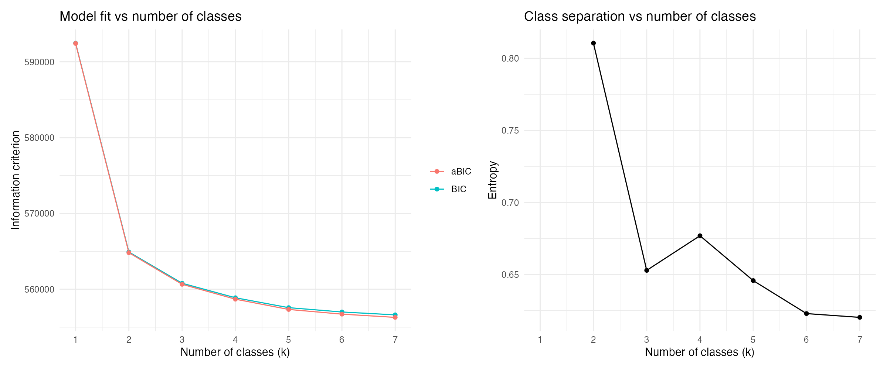
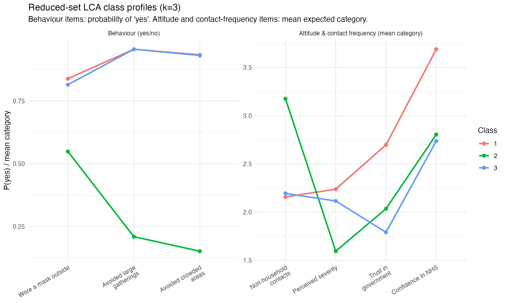
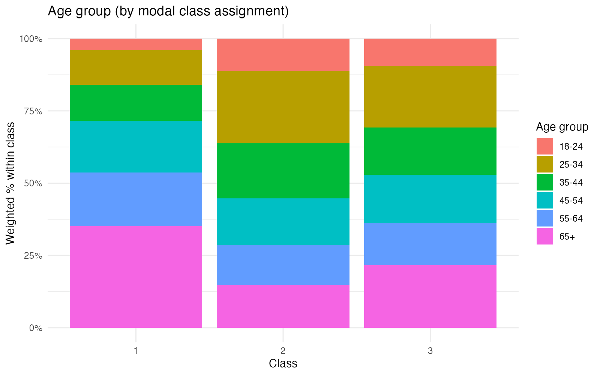
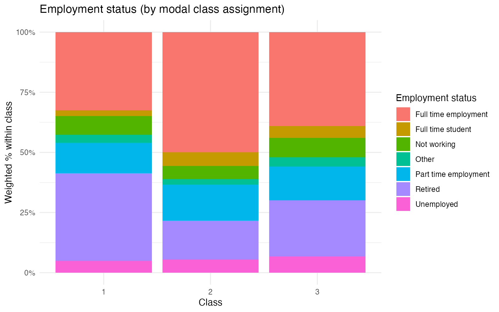
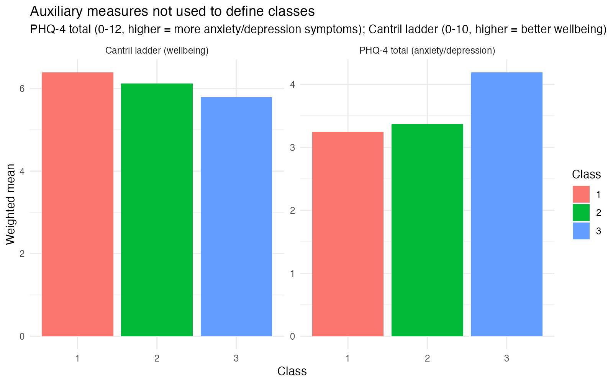
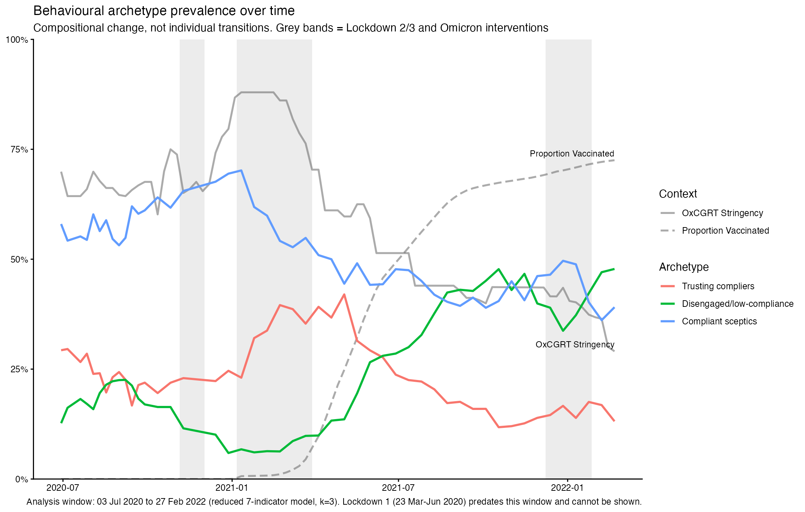

# YouGov behavioural archetypes — reduced-set LCA (k=3)

Latent class analysis of 7 YouGov indicators (4 behaviour + 3 attitude), UK, Jul 2020 – Feb 2022.

## Data

| | |
|---|---|
| Source | YouGov COVID-19 tracker, UK |
| Analysis window | 3 Jul 2020 – 27 Feb 2022 (repeated cross-section, not panel) |
| Waves | 48 |
| N (complete cases on indicators) | 45,501 |
| N per wave | 885–1,029 (mean 948) |

Window excludes UK Lockdown 1 (23 Mar–Jun 2020) — `severity_cat`/`govt_trust_cat` weren't fielded together with the other indicators until 3 Jul 2020.

## Indicators

| Type | Item | Recode |
|---|---|---|
| Behaviour | Wore a mask outside | binary |
| Behaviour | Avoided large gatherings | binary |
| Behaviour | Avoided crowded areas | binary |
| Behaviour | Non-household contacts | banded 1–4 |
| Attitude | Perceived severity | 1–3 |
| Attitude | Trust in government | 1–4 |
| Attitude | Confidence in NHS | 1–4 |

Fear (`WCRV_4`) considered and dropped: only covers Apr–Sep 2020, unusable across a 2-year window. Full recode dictionary: `../data/yougov_lca_recode_dictionary.csv`.

**Fixed-classes assumption:** class *profiles* (what each archetype looks like) are assumed stable over the whole window; only class *prevalence* (share of the population) is allowed to change over time. Untested here — a candidate for future measurement-invariance work.

## Model selection

k=3 chosen: entropy peaks sharply at k=2 (0.81) and never recovers to that level for k≥3; BIC/aBIC improve monotonically with no elbow (expected — see Ground rule 7 on correlated indicators inflating apparent fit). k=3 keeps two well-sized classes plus a third revealing genuine attitude/behaviour divergence (below), without the thin (<6%) classes seen at k≥4.

## Class profiles

| Class | Size | Label |
|---|---|---|
| 1 | 27.0% | Trusting compliers |
| 2 | 24.2% | Disengaged / low-compliance |
| 3 | 48.8% | Compliant sceptics |

Entropy = 0.653.

**Key finding:** Classes 1 and 3 are behaviourally near-identical (both highly compliant) but diverge sharply on government trust and NHS confidence — attitude adds a distinction behaviour alone would miss. The 1/3 split is carried almost entirely by the 2 attitude items; the 4 behaviour items don't discriminate between them at all. Full detail: `lca_reduced_analysis_notes.md`.

## Who's in which class?

Covariate LR tests (all p<0.001, but N=44,755 — significance here doesn't imply large effects; see coefficients in `lca_reduced_covariate_tests.csv`):

| Model | LR stat | df | p |
|---|---|---|---|
| ~ age | 13,968 | 2 | <0.001 |
| ~ employment_status | 12,821 | 12 | <0.001 |
| ~ age + gender + employment_status + household_size | 14,792 | 30 | <0.001 |

Age separates "Disengaged" from the other two classes clearly, but barely distinguishes "Trusting compliers" from "Compliant sceptics" — the interesting split is not an age effect.

Employment predicts membership, but also constrains behaviour directly (e.g. essential workers can't reduce contacts regardless of attitude) — archetype-effect and constraint-effect can't be separated with this data alone. Remaining demographics (gender, region, household size/children): `lca_distributions/`.

Auxiliary wellbeing measures (not used to define classes) — "Compliant sceptics" report the lowest wellbeing and highest anxiety/depression symptoms of the three:

## Prevalence over time

"Compliant sceptics" peak during Lockdown 3 (~70%) while "Disengaged" hits its lowest point in the same window — consistent with legal/social pressure driving compliance even absent institutional trust. The pattern reverses post-vaccine-rollout: "Disengaged" rises steadily from mid-2021, overtaking "Compliant sceptics" by the Omicron-restrictions period. Compositional change only — YouGov is a repeated cross-section, this is not individuals moving between archetypes.

## How to read the outputs

| File | Contents |
|---|---|
| `lca_reduced_model_selection.{csv,png}` | k=1–7 fit statistics |
| `lca_reduced_class_profiles.{csv,png}` | Class-by-item response probabilities |
| `lca_reduced_covariate_tests.csv` | LR tests, age/employment/combined models |
| `lca_distributions/*` | Demographic composition + wellbeing by class |
| `lca_reduced_prevalence_{weekly,monthly}.csv` | Class share over time |
| `lca_context_mobility_weekly.csv` | Google Mobility, UK (loaded, not plotted — different scale) |
| `lca_reduced_analysis_notes.md` | Full findings, Wright et al. comparison |
| `../models/lca_reduced_fit_k3.rds` | Fitted model object |

## Assumptions and limitations

- Fixed classes across time (profiles), only prevalence varies.
- LCA fitted unweighted; survey weights applied only at descriptive/prevalence stage.
- Complete-case on the 7 indicators, assumed missing at random.
- Modal class assignment ignores classification uncertainty (entropy 0.653; weaker still for the Class 1/3 split specifically).
- Prevalence trends are compositional, not individual transitions (repeated cross-section).
- Employment constrains behaviour directly as well as predicting archetype — effects not separable here.
- Analysis window excludes Lockdown 1.
- Reduced 7-indicator set only; full ~19-indicator set not run this pass.

## Next steps

- Full ~19-indicator model (time permitting).
- Measurement invariance testing by policy phase.
- Individual-level CoMix/REACT data for true transitions (not compositional).
- Three-step/BCH correction for covariate tests (currently one-step concomitant — see Ground rule/Wright comparison in `lca_reduced_analysis_notes.md`).
